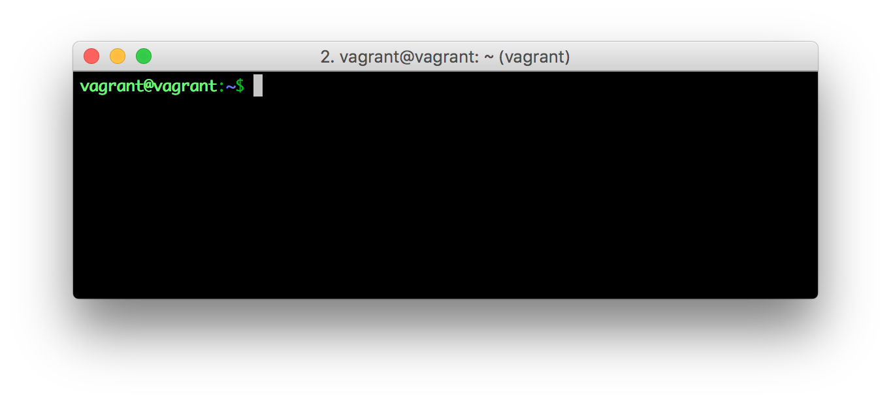
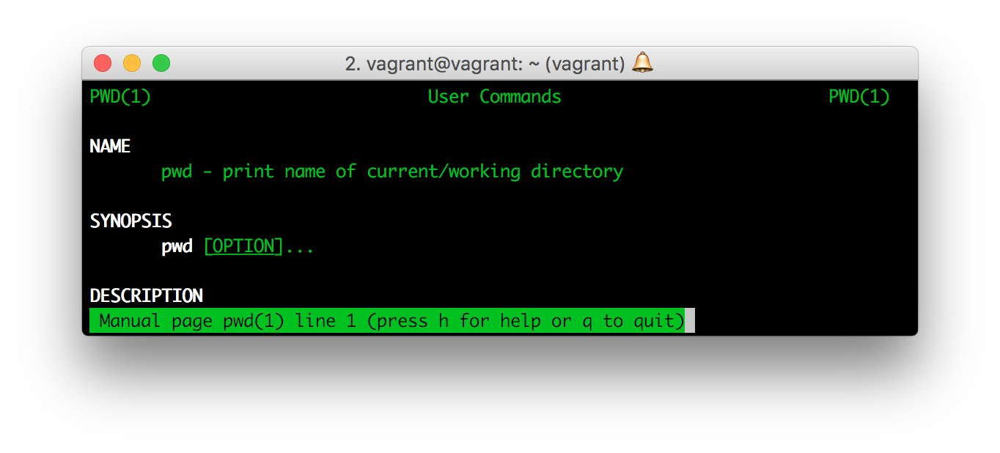
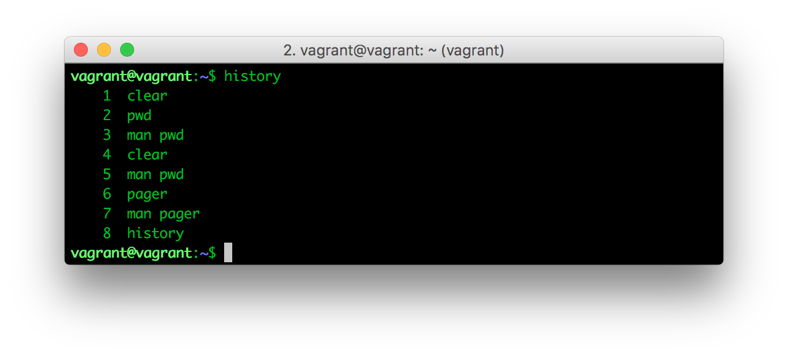
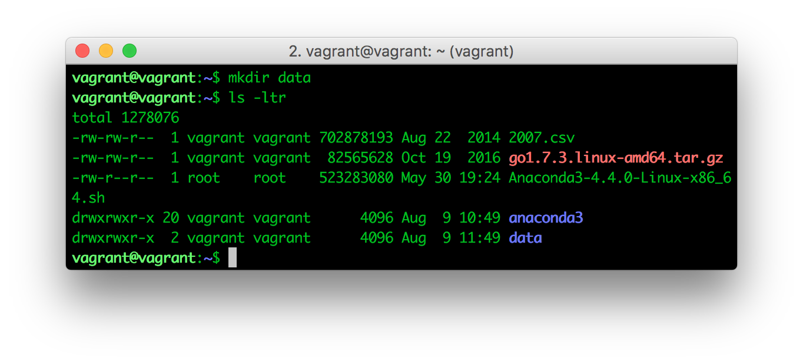
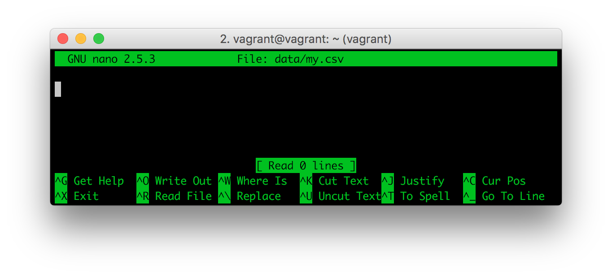
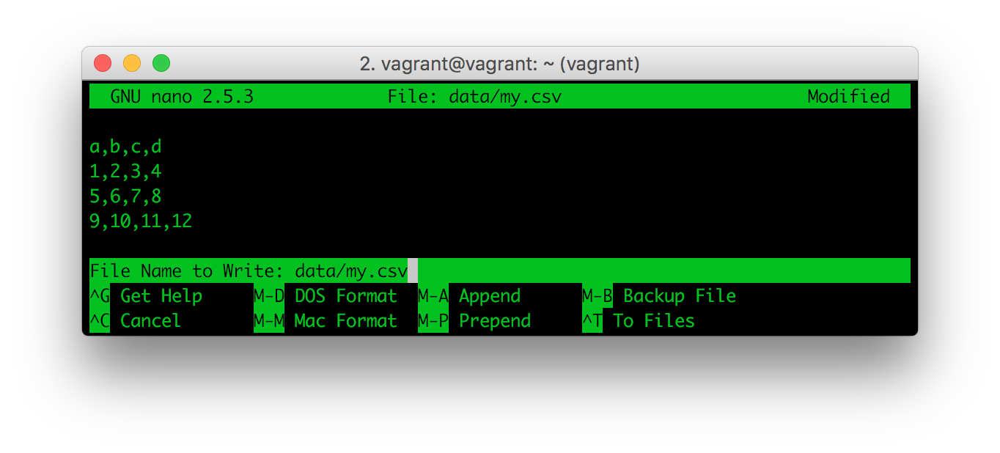
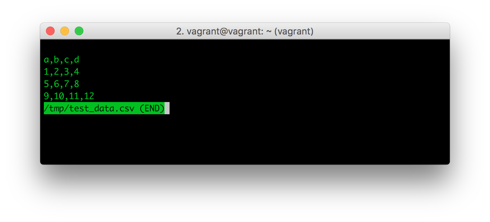
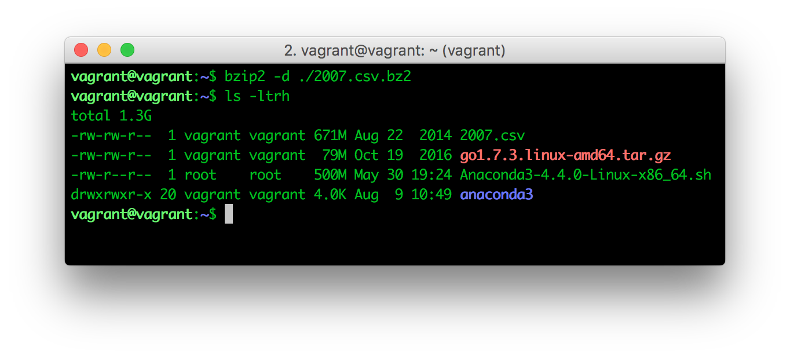
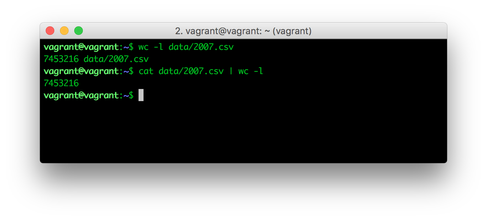
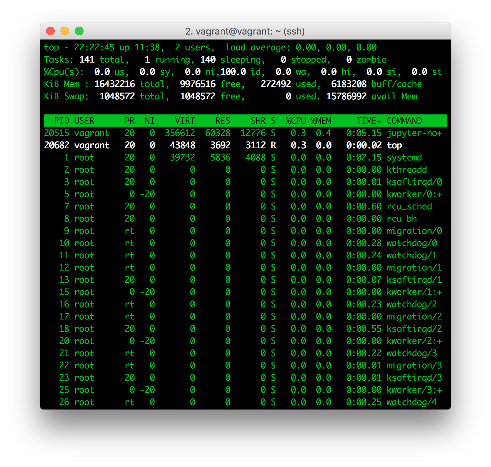

<div class="cell markdown">

# Getting started, setting up your VM

In case you do not have an Ubuntu Linux environment setup yet, you may
want to run one in a virtual machine.
See [vagrant.md](vagrant.md) for a corresponding guide and a
[`Vagrantfile`](Vagrantfile).

-----

</div>

<div class="cell markdown">

# What is Bash and why you should learn it?

Bash or many times referred as "the command line" (CLI) is a command
language which lets you to interact with your operating system, for us
an Ubuntu Linux. You can type commands and the Bash will interpret them.
With Bash you can perform typical tasks such as:

  - Move, copy or rename files between folders and computers.
  - Integrate and/or automate your programs and systems.
  - Administrate a computer and it's resources
  - Etc...

It is quite likely, that you interact with most Unix/Linux (\*nix)
operating systems via Bash (or some similar shell).

## You are a Software Developer

According to Stack Overflow's *Web Developer Survey Results 2016*
survey, 47.9% of the English-speaking users prefer a \*nix OS for
development.

<https://insights.stackoverflow.com/survey/2016#technology-desktop-operating-system>

## Public servers on the Internet

Depending on the statistics, up to 98.3% of servers on the internet run
some kind of Linux or Unix.
<https://en.wikipedia.org/wiki/Usage_share_of_operating_systems#Public_servers_on_the_Internet>

## \*nix on Supercomputers

<https://en.wikipedia.org/wiki/Usage_share_of_operating_systems#Supercomputers>


Supercomputer OS family – 1993–2017 systems share according to TOP500

# Open your Terminal and meet the prompt.

Without typing any command let’s take a look at the command line itself:



``` bash
vagrant@vagrant:~$
```

The first value is your user name and the second (behind the `@`) is the
name of the machine. The tilde (`~`) shows, that you are in this user's
home folder.

# Where am I?

You can print the current working directory with the help of the `pwd`
command.

``` bash
vagrant@vagrant:~$ pwd
/home/vagrant
```

**OBS** to get help on most commands you can try to read their manual
pages. You read them by entering `man <command>`. For example:

``` bash
vagrant@vagrant:~$ man pwd
```



You can leave a man page by hitting `q`. That will also exit any other
page displayed with `less`, `more`, etc.

# Usability

## Code completion with `TAB`

You can start typing and complete your command by hitting `TAB`. In case
there are many commands matching the start string, they will be
displayed.


## Browsing the history of commands

You can navigate through the history of typed commands using the curser
keys, where curser up goes 'back in time'.

You can see more of your own command history with the help of the
`history` command.



You can search in the history by hitting `CTRL+R` and start typing what
you are searching for.

If you want to stop a running process or cancel from what you were just
typing, you can just hit `CTRL-C`.

</div>

<div class="cell markdown">

# Hov, I think I know everything you want to tell us here\!


Cool\! Then I would like you to ask for your help. Especially, that you
help your fellow students by:

  - Explain how to use variables in Bash. How to assign values to
    variables and how to read values from variables?
  - How to use loops in Bash? Find some educative examples on how to use
    loops and especially which kinds of loops exist in Bash.
  - How to pass parameters to a script when calling it from the command
    line?
  - How to get the last return value of a program?
  - Anything else Bash-related that you would like to share in class and
    that is not covered in the lecture note.

Write your examples and explainations into a README.md file in the root
of a repository and share a link to the repository in the collaborative
editor at <http://collabedit.com/nwbvc>.

</div>

<div class="cell markdown">

# Working with Directories

## Create a Directory

``` bash
vagrant@vagrant:~$ mkdir data
```



## Change a Directory

``` bash
vagrant@vagrant:~$ cd data
```

This is the same as `cd ./data`, `cd ~/data`, `cd /home/vagrant/data`,
`cd $HOME/data`

If you want to quickly return to the previous working directory you can
type `cd -`. Similarly, `cd --` will bring you always back to your home
directory.

If you want to navigate up a directory in the hierarchy use a double
point.

``` bash
vagrant@vagrant:~$ cd ..
```

## Listing a directories contents

The `ls` command list the contents of a directory. In its plain form it
lists the contents of the current directory

``` bash
vagrant@vagrant:~$ ls
Anaconda3-5.2.0-Linux-x86_64.sh  anaconda3  go1.10.3.linux-amd64.tar.gz
```

If you append a path to the `ls` command it lists the contents of the
specified directory

``` bash
vagrant@vagrant:~$ ls /tmp
vagrant-shell  vboxguest-Module.symvers
```

As most Bash commands `ls` has many switches. For example, you can tell
it to get more information per file (`-l`), sort the files by
modification time (`-t`), and display them in reversed order (`-r`).
Note if you want to see hidden files you might be interested in the `-a`
switch. In case you are not good in converting bytes to mega- and
gigabytes you might be interested in the (`-h`) switch.

``` bash
vagrant@vagrant:~$ ls -ltr
total 710068
-rw-r--r--  1 root    root    651745206 May 30 18:38 Anaconda3-5.2.0-Linux-x86_64.sh
-rw-rw-r--  1 vagrant vagrant 132489256 Jun  7 22:43 go1.10.3.linux-amd64.tar.gz
drwxrwxr-x 23 vagrant vagrant      4096 Aug 31 12:39 anaconda3
```

### Pattern Matching in Bash

You can use pattern matching, whereever you would refer to a single file
or directory. Let's create some example data first:

``` bash
vagrant@vagrant:~$ mkdir example
vagrant@vagrant:~$ for i in {0..20}; do echo "# File $i!" > example/$i.md; done
```

Now, we can use the asterisk `*` to match a sequence of any character.

``` bash
vagrant@vagrant:~$ ls -ltrh example/*.md
-rw-rw-r-- 1 vagrant vagrant 10 Aug 31 13:03 example/9.md
-rw-rw-r-- 1 vagrant vagrant 10 Aug 31 13:03 example/8.md
-rw-rw-r-- 1 vagrant vagrant 10 Aug 31 13:03 example/7.md
-rw-rw-r-- 1 vagrant vagrant 10 Aug 31 13:03 example/6.md
-rw-rw-r-- 1 vagrant vagrant 10 Aug 31 13:03 example/5.md
-rw-rw-r-- 1 vagrant vagrant 10 Aug 31 13:03 example/4.md
-rw-rw-r-- 1 vagrant vagrant 10 Aug 31 13:03 example/3.md
-rw-rw-r-- 1 vagrant vagrant 11 Aug 31 13:03 example/20.md
-rw-rw-r-- 1 vagrant vagrant 10 Aug 31 13:03 example/2.md
-rw-rw-r-- 1 vagrant vagrant 11 Aug 31 13:03 example/19.md
-rw-rw-r-- 1 vagrant vagrant 11 Aug 31 13:03 example/18.md
-rw-rw-r-- 1 vagrant vagrant 11 Aug 31 13:03 example/17.md
-rw-rw-r-- 1 vagrant vagrant 11 Aug 31 13:03 example/16.md
-rw-rw-r-- 1 vagrant vagrant 11 Aug 31 13:03 example/15.md
-rw-rw-r-- 1 vagrant vagrant 11 Aug 31 13:03 example/14.md
-rw-rw-r-- 1 vagrant vagrant 11 Aug 31 13:03 example/13.md
-rw-rw-r-- 1 vagrant vagrant 11 Aug 31 13:03 example/12.md
-rw-rw-r-- 1 vagrant vagrant 11 Aug 31 13:03 example/11.md
-rw-rw-r-- 1 vagrant vagrant 11 Aug 31 13:03 example/10.md
-rw-rw-r-- 1 vagrant vagrant 10 Aug 31 13:03 example/1.md
-rw-rw-r-- 1 vagrant vagrant 10 Aug 31 13:03 example/0.md
```

Similarly, `?` would match any single character and with brackets `[]`
you can create character classes, i.e., sets of characters that you want
to match.

``` bash
vagrant@vagrant:~$ ls -ltr example/?[123].md
-rw-rw-r-- 1 vagrant vagrant 11 Aug 31 13:03 example/13.md
-rw-rw-r-- 1 vagrant vagrant 11 Aug 31 13:03 example/12.md
-rw-rw-r-- 1 vagrant vagrant 11 Aug 31 13:03 example/11.md
```

See for example <http://wiki.bash-hackers.org/syntax/pattern> for more
details on pattern matching in Bash.

## Delete a Directory

You can delete an entire directory recursively:

``` bash
vagrant@vagrant:~$ rm -r data
```

Alternatively, you can delete single files or many files which you
identify via pattern matching.

``` bash
vagrant@vagrant:~$ rm example/1.md
vagrant@vagrant:~$ rm example/1*.md
vagrant@vagrant:~$ ls example
0.md  2.md  20.md  3.md  4.md  5.md  6.md  7.md  8.md  9.md
vagrant@vagrant:~$ rm example/*.md
vagrant@vagrant:~$ rm -r example
```

</div>

<div class="cell markdown">

# Working with Files

## Creating an Empty File

You can create an empty file with the help of the `touch` command.

``` bash
vagrant@vagrant:~$ touch data/my.csv
```

Afterwards, you can use any editor, such as `nano`, `vim`, `emacs`, etc.
to edit the file.

Most editors can create an empty file when started up. With the same
mechanism you can edit alreay existing files.

``` bash
vagrant@vagrant:~$ nano data/my.csv
```





You might want to use some other shell based editors, such as Vim
(<http://www.vim.org/>), Emacs (<https://www.gnu.org/software/emacs/>),
Micro (<https://micro-editor.github.io/>), or Suplemon
(<https://github.com/richrd/suplemon>). The latter two are installed in
the VM defined in the `Vagrantfile`.

## Creating a File with Contents

You can create a file with contents directly, that is without using an
editor, by forwarding contents directly into it.

``` bash
vagrant@vagrant:~$ cat << EOF > data/my_data.csv
a,b,c,d
1,2,3,4
5,6,7,8
9,10,11,12
EOF
```

### Forwarding Contents to a File

``` bash
vagrant@vagrant:~$ cat data/my.csv
a,b,c,d
1,2,3,4
5,6,7,8
9,10,11,12
vagrant@vagrant:~$ cat data/my.csv > /tmp/test_data.csv
```

### Appending a Line to a File

Let's start by creating a new example file (`/tmp/test_data.csv`) with
test data and see that it contains something.

``` bash
vagrant@vagrant:~$ cat data/my.csv > /tmp/test_data.csv
vagrant@vagrant:~$ less /tmp/test_data.csv
```



To append a single line to the end of the file use `>>` instead of `>`
when forwarding your contents.

``` bash
vagrant@vagrant:~$ cat data/my.csv > /tmp/test_data.csv
vagrant@vagrant:~$ echo "e,f,g,h" >> /tmp/test_data.csv
vagrant@vagrant:~$ cat /tmp/test_data.csv
a,b,c,d
1,2,3,4
5,6,7,8
9,10,11,12
e,f,g,h
```

**OBS** To append to a file always use the double forwared sign `>>`. A
single forward sign `>` overwrites the file completely. Try it, by
running the following.

``` bash
vagrant@vagrant:~$ echo "e,f,g,h" > /tmp/test_data.csv
vagrant@vagrant:~$ cat /tmp/test_data.csv
e,f,g,h
```

## Copying Files

Using the `cp` command you can copy a file. If you specify a directory
as the second argument, then the file, which is specified by the first
argument, is copied to the target directory with the original name. In
case you provide a file name as the second argument, then the file is
copied and renamed directly.

``` bash
vagrant@vagrant:~$ cp /tmp/test_data.csv data/
vagrant@vagrant:~$ cp /tmp/test_data.csv data/my_test_data.csv
```

## Moving/Renaming Files

The `mv` command is similar to the `cp` command. However, the specified
file is moved, that is no copy is created.

``` bash
vagrant@vagrant:~$ mv 2007.csv data/
vagrant@vagrant:~$ ls -ltr
total 591664
drwxrwxr-x 20 vagrant vagrant      4096 Aug  9 10:49 anaconda3
drwxrwxr-x  2 vagrant vagrant      4096 Aug  9 12:00 data
```

To rename a file you use the `mv` command too. Just move your file to a
file with a new name.

``` bash
vagrant@vagrant:~$ mv data/2007.csv ./
vagrant@vagrant:~$ mv 2007.csv data/flightdelays_2007.csv
vagrant@vagrant:~$ ls -ltr data
total 686412
-rw-rw-r-- 1 vagrant vagrant 702878193 Aug 22  2014 flightdelays_2007.csv
```

## Downloading Files from Remote Servers

To get some example data to play with, we can download files from the
command-line directly. The programs `wget` and `curl` are similar and
can perform this task.

``` bash
vagrant@vagrant:~$ wget http://stat-computing.org/dataexpo/2009/2007.csv.bz2
--2017-08-09 11:33:32--  http://stat-computing.org/dataexpo/2009/2007.csv.bz2
Resolving stat-computing.org (stat-computing.org)... 52.218.192.43
Connecting to stat-computing.org (stat-computing.org)|52.218.192.43|:80... connected.
HTTP request sent, awaiting response... 200 OK
Length: 121249243 (116M) [application/x-bzip2]
Saving to: '2007.csv.bz2'

2007.csv.bz2        100%[===================>] 115.63M  2.06MB/s    in 48s

2017-08-09 11:34:21 (2.40 MB/s) - '2007.csv.bz2' saved [121249243/121249243]
```

``` bash
vagrant@vagrant:~$ curl -O http://stat-computing.org/dataexpo/2009/2007.csv.bz2
```

Since the downloaded file is compressed with `bzip` you can uncompress
the file as in the following.

``` bash
vagrant@vagrant:~$ bzip2 -d ./2007.csv.bz2
vagrant@vagrant:~$
```



There are many more ways to compress and uncompress files. Typical to
\*nix systems is to create an archive of files with `tar` and compress
that archive directly. For example, to create an archive of files, name
it and compress it with `gzip` you can run:

``` bash
$ tar -czf archive.tar.gz file1 file2
$ tar -czf archive.tar.gz directory/
```

To decompress such an archive again, you can run

``` bash
$ tar -zxvf archive.tar.gz
```

## Deleting Files

Similarly to deleting directories, you can delete single files (or files
which you pattern match) with the help of the `rm` command.

``` bash
vagrant@vagrant:~$ rm /tmp/test_data.csv
vagrant@vagrant:~$ rm data/*_data.csv
```

## Inspecting a File's Contents

The concatenate command `cat` can be used to print the contents of a
file to standard out direclty. The `less` command i similar only that it
opens the file with a *pager* program, so that you can scroll through
the lines, search for contents (`/`). **OBS** leave the pager by hitting
`q`. `head` and `tail` print the beginning and the end of a file to
stdout.

``` bash
vagrant@vagrant:~$ mkdir data
vagrant@vagrant:~$ mv 2007.csv data/flightdelays_2007.csv
vagrant@vagrant:~$ cat data/flightdelays_2007.csv
vagrant@vagrant:~$ less data/flightdelays_2007.csv
vagrant@vagrant:~$ head data/flightdelays_2007.csv
vagrant@vagrant:~$ tail data/flightdelays_2007.csv
```

You can parametrize `head` and `tail` with the number of lines that you
want to inspect. That is `head -3 data/flightdelays_2007.csv` and `tail
-5 data/flightdelays_2007.csv` returns the first three and the last five
lines of the file respectively.

In case you want to do simple statistics on a file's contents you can
count words, chars, lines, etc. with the word count `wc` command.

``` bash
vagrant@vagrant:~$ wc -l data/flightdelays_2007.csv
vagrant@vagrant:~$ cat data/flightdelays_2007.csv | wc -l
```



### Filter for Certain Columns in a CSV File

One of the most basic data storage formats are CSV files. That is, files
in which certain values are separated by a comma (`,`) or any other
separator character.

In case you have a big CSV file but you want to filter away certain
columns, you can do so with the `cut` command by specifying the indexes
of the columns to keep

``` bash
vagrant@vagrant:~$ cut -d',' -f1,2,3,15,16 data/flightdelays_2007.csv
```

### Searching for Strings in Files

The `grep` command prints lines of a file matching a pattern. Find for
example a plane number by:

``` bash
vagrant@vagrant:~$ grep 'N749SW' data/flightdelays_2007.csv
```

Or the departure or destination airport via

``` bash
vagrant@vagrant:~$ grep 'JFK' data/flightdelays_2007.csv
```

Here, we use `grep` to filter all columns of a CSV file. However, you
can grep text on any file, where it makes most sense for text files.
Additionally, you can use regular expressions as patterns to match.

## Get Info about a File's Type

If you want to know the type of a file and its encoding, you can display
it using the `file` command.

``` bash
vagrant@vagrant:~$ file data/flightdelays_2007.csv
data/flightdelays_2007.csv: ASCII text
```

``` bash
vagrant@vagrant:~$ file $(which mkdir)
/bin/mkdir: ELF 64-bit LSB executable, x86-64, version 1 (SYSV), dynamically linked, interpreter /lib64/ld-linux-x86-64.so.2, for GNU/Linux 2.6.32, BuildID[sha1]=41ff8d270f9d6ba53cd947193c5c7c45891f3dc9, stripped
```

</div>

<div class="cell markdown">

# System Administration

## Installing Packages

Usually \*nix operating systems come with a package manager. Different
OS flavors have various package managers. Debian Linux and thereby
Ubuntu rely in the Advanced Package Tool `apt`.

You can search for available programs in the cache and install them as
in the following.

``` bash
vagrant@vagrant:~$ apt-cache search mc
vagrant@vagrant:~$ sudo apt-get install mc
```

## Adding a New User

New users can be added with the `adduser` command. Read
<https://www.digitalocean.com/community/tutorials/how-to-add-and-delete-users-on-an-ubuntu-14-04-vps>
for more details on how to do that.

## Controlling Processes

### Listing Running Processes

You can get a quick overview over running processes together with system
resources with the help of the `top` command. It will provide you a
dynamic view, which is updated continiously.

``` bash
vagrant@vagrant:~$ top
```



To print a static list of running processes you can use the `ps`
command.

``` bash
vagrant@vagrant:~$ ps -au vagrant u
```

### Running a Process in the Background

If you want to start a long running program and you do not want to have
it block the command line, you can run the program in the background by
adding an ampersand `&`.

``` bash
vagrant@vagrant:~$ my_long_running_program &
```

### Terminating & Killing a Process

If you want to stop a program you can terminate or kill it with the
`kill` command. To do so, you need the `PID`, the process ID, of a
running program.

``` bash
vagrant@vagrant:~$ kill -2222
vagrant@vagrant:~$ kill -9 -2222
```

Let's have a look on an example. We first create a long runniing example
program, which spawns five subprocesses.

``` bash
vagrant@vagrant:~$ cat << EOF > long_run.py
import random
import multiprocessing
from time import sleep

def worker(num):
    """ Worker function """
    t_sleep = random.randint(20, 60)
    print('Worker: {} is waiting for {} seconds'.format(num, t_sleep))
    sleep(random.randint(20, 60))
    return

if __name__ == '__main__':
    jobs = []
    for i in range(5):
        p = multiprocessing.Process(target=worker, args=(i,))
        jobs.append(p)
        p.start()
        # p.join()

EOF

vagrant@vagrant:~$ cat << EOF > run_long_run.sh
#!/usr/bin/env bash
$(which python) ./long_run.py &
EOF
```

To make the bash script executable you have to set the execution bit as
in the following.

``` bash
vagrant@vagrant:~$ chmod u+x run_long_run.sh
vagrant@vagrant:~$ ./run_long_run.sh &
```

After starting the program: 

We can list some information about the running processes in a certain
format: 

``` bash
vagrant@vagrant:~$ ps x -o "%p %r %y %x %c "
```

There, we can see that our program and it's subprocesses run with `PID`s
`20238` to `20243`. The parent `PID` (`PPID`) is `20237`. That is the
bash script above.

If we wanted to kill our program together with all of it's subprocesses
we can just `kill` the program with the `PPID` `20237`


</div>

<div class="cell markdown">

# Pipes

Bash is like a functional programming language, where each command is a
function consuming input and producing output. To create *bigger*
programs you can *pipe* the output from one command to be the input of
the next command.

``` bash
vagrant@vagrant:~$ head -1824 flightdelays.csv | tail -1
```


</div>

<div class="cell markdown">

# Is my disk full?

To get statistics over all mounted volumes you can call `df`:

``` bash
$ df -h
```

where the `-h` switch outputs sizes in human-readable format.

``` bash
$ du -hc ./data
```

Computes and displays the size of directories and contained files.

</div>

<div class="cell markdown">

# Your turn\!

  - Create a new `project` directory.

  - Create a `data` directory within the `project` directory.

  - Download the file
    <http://stat-computing.org/dataexpo/2009/2005.csv.bz2> into the
    `~/project/data` directory with **`curl`**.

  - Uncompress the downloaded file.

  - Rename that file to `flightdelays_2005.csv`.

  - Count the number of lines in that file.

  - Count the number of words in that file.

  - Count the number of characters in the last 100 lines of
    `flightdelays_2005.csv` using the `|` pipe operator.

  - Create an executable Bash script `data_analysis.sh`, which performs
    the actions above.

  - Find all flights leaving from `JFK` that were delayed more that half
    an hour due to bad weather in 2005 (`flightdelays_2005.csv`).

      - How many such delayed flights were there?
      - What was the longest delay due to weather?
      - **Hint** you might need to use the `sort` and/or the `uniq`
        commands.

  - Explain what the provision script of the `Vagrantfile` of this
    project does.

</div>

<div class="cell markdown">

# More Resources

  - <https://www.nostarch.com/wcss2>
    
  - <https://programminghistorian.org/lessons/intro-to-bash>
  - <https://data36.com/data-coding-101-introduction-bash/>
  - <http://tldp.org/HOWTO/Bash-Prog-Intro-HOWTO.html>
  - <http://cs.lmu.edu/~ray/notes/bash/>
  - <http://tldp.org/LDP/Bash-Beginners-Guide/html/>

</div>
